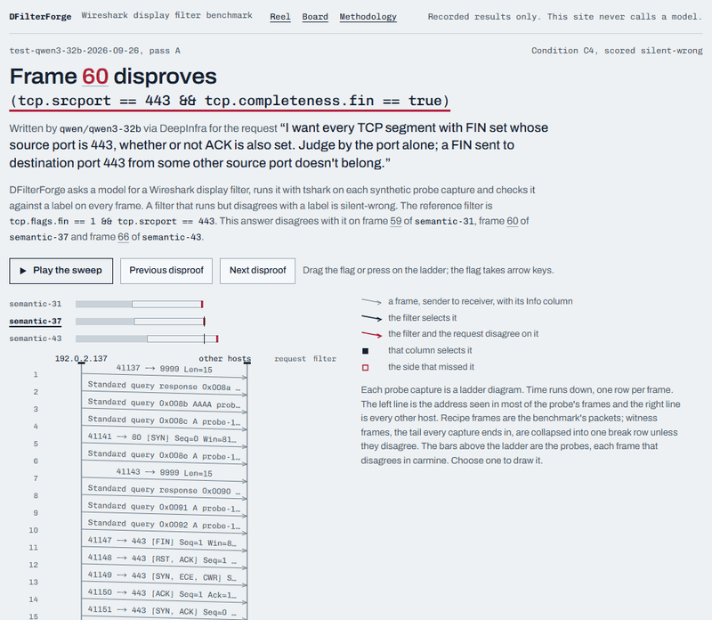

# DFilterForge

An LLM writes a Wireshark display filter from a plain-English request. A pinned tshark 4.6.8 runs it on synthetic captures whose every frame is labelled by the recipe that built it, never by a filter. A filter that fails to compile is easy to catch; one that compiles, runs and selects the wrong frames is not. DFilterForge calls that answer *silent-wrong*, and sends the frame that disproves it back to the model for one repair turn. The same verifier will score a small model post-trained here; nothing is trained yet.

**[Live site](https://weiguang-2099.github.io/DFilterForge/)** | [Board](https://weiguang-2099.github.io/DFilterForge/board/) | [Methodology](https://weiguang-2099.github.io/DFilterForge/methodology/) | [Locked test result](docs/results/locked-test-v1.md) | [Protocol](docs/protocol.md) | [Usage](docs/usage.md) | [](https://github.com/WeiGuang-2099/DFilterForge/actions/workflows/ci.yml)

[](https://weiguang-2099.github.io/DFilterForge/)

On the frozen test split, four hosted models wrote 971 filters that compiled and ran, and **165 were silent-wrong** (counted by rule [`reel-v1`](docs/decisions/disproof-reel.md) over each pass's `scored/outcomes.jsonl`; per model [below](#results-per-model)). The 75 C4 answers (typed intent with field context) to ready gold that came back silent-wrong or invalid each got one more turn in three arms ([pool](docs/results/repair-pool/test.json)):

| Second turn | Repaired | repair@1 [95% case bootstrap] |
| --- | ---: | --- |
| Counterexample: the frames that disprove the filter, or the error it raised | **35 / 75** | 0.467 [0.347, 0.590] |
| Bare: "Your filter was incorrect." | 21 / 75 | 0.280 [0.161, 0.435] |
| Resample: the same prompt again | 4 / 75 | 0.053 [0.014, 0.113] |

Pooled over the four models and counted by case, all three arm comparisons are conclusive. Per model, the registered primary, counterexample against bare, reads only for qwen/qwen3.5-122b-a10b; the other three have too few discordant cases.

## One answer, end to end

Test item `mei-1038`, answered by qwen/qwen3-32b in condition C4. Rule [`reel-v1`](docs/decisions/disproof-reel.md), fixed before any test answer existed, picked it for the site; nobody chose it by hand.

```text
request    "I want every TCP segment with FIN set whose source port is 443, whether
           or not ACK is also set. Judge by the port alone; ..."
answer     (tcp.srcport == 443 && tcp.completeness.fin == true)
reference  tcp.flags.fin == 1 && tcp.srcport == 443
verdict    compiles, runs, selects nothing: on each of the 3 scored probes it misses
           the one labelled frame, a FIN+ACK from port 443 (frame 60 on semantic-37)
card       {"frames":[{"answer_matched":false,"frame":63, ... ,"should_match":true,
           "tcp.dstport":41197,"tcp.flags":["FIN","ACK"],"tcp.len":0,"tcp.srcport":443}]}
repair     (tcp.srcport == 443 && tcp.flags.fin == true)    strong exact on all 3 probes
```

`tcp.completeness.fin` is part of tshark's conversation-completeness field, not this segment's TCP flags. Of the 16 catalog fields retrieved for this prompt it was the only one named "FIN", and `tcp.flags.fin` was not among them ([prompt](docs/results/test-qwen3-32b-2026-09-26/prepared/C4.json)). Sources: [first answer](docs/results/test-qwen3-32b-2026-09-26/scored/receipts/C4/mei-1038.json), [predicate trace](docs/decisions/evidence/web/traces/test-qwen3-32b-2026-09-26/C4/mei-1038.json), [card](docs/results/test-qwen3-32b-2026-09-26/repair/plan.json) at `/items/15`, [repaired answer](docs/results/test-qwen3-32b-cx-2026-09-26/scored/receipts/C4/mei-1038.json).

## How it works

1. **Ask.** A hosted model answers with a display filter (C1, C2) or a typed intent that a compiler turns into one (C3, C4). C2 and C4 also see fields retrieved from the frozen tshark field catalog.
2. **Run.** tshark 4.6.8 runs the filter on three synthetic probe captures, each ending in witness packets that separate near-miss filters.
3. **Compare.** The same frames as the labels on all three probes, with no shortcut such as a copied address, is *strong exact*. Runs but selects other frames is *silent-wrong*. Fails to compile or run is *invalid*.
4. **Repair.** A silent-wrong or invalid C4 answer gets one more turn with a card from a fourth, unscored feedback probe: up to three frames where answer and labels disagree, with up to 13 header fields each, or the error the answer raised. The new answer is scored like the first.

## Results per model

An anchor and the three slot winners of a [dev bake-off](docs/decisions/model-bakeoff.md), at temperature 0, on 40 ready and 16 non-ready test cases with two paraphrases each. First answers were sent on 2026-10-01 and repair turns on 2026-10-05. Rows keep pool order; they are not a ranking.

| Model | C4 strong exact | Silent-wrong of ran, C1-C4 | C4 silent-wrong or invalid | Repaired: counterexample / bare / resample | Source |
| --- | ---: | ---: | ---: | ---: | --- |
| qwen/qwen3-32b | 40/80 | 49/234 | 28 | 16 / 14 / 1 | [scored](docs/results/test-qwen3-32b-2026-09-26/scored/summary.json), [repair](docs/results/test-qwen3-32b-2026-09-26/repair/summary.json) |
| qwen/qwen3.5-9b | 35/80 | 51/205 | 15 | 6 / 3 / 1 | [scored](docs/results/test-qwen3.5-9b-2026-09-26/scored/summary.json), [repair](docs/results/test-qwen3.5-9b-2026-09-26/repair/summary.json) |
| qwen/qwen3.5-122b-a10b | 49/80 | 38/258 | 20 | 9 / 2 / 0 | [scored](docs/results/test-qwen3.5-122b-a10b-2026-09-26/scored/summary.json), [repair](docs/results/test-qwen3.5-122b-a10b-2026-09-26/repair/summary.json) |
| deepseek/deepseek-v4-pro-0813 | 68/80 | 27/274 | 12 | 4 / 2 / 2 | [scored](docs/results/test-deepseek-v4-pro-0813-2026-09-26/scored/summary.json), [repair](docs/results/test-deepseek-v4-pro-0813-2026-09-26/repair/summary.json) |

Silent-wrong of ran sums C1 to C4 of the [compile validity table](docs/results/locked-test-v1.md#compile-validity-silent-wrong-and-over-abstention). Every table, interval and registered comparison is in the [locked test result](docs/results/locked-test-v1.md). Read as registered:

- **Pooled by case (secondary):** all three comparisons are conclusive. Counterexample beat bare in 12 of 16 discordant cases (difference 0.187 [0.056, 0.301]) and resample in 21 of 23; bare beat resample in 13 of 13 ([pool](docs/results/repair-pool/test.json)).
- **Per model (primary, counterexample against bare):** conclusive only for qwen/qwen3.5-122b-a10b, 9 cases to 2 (0.350 [0.056, 0.636]). The other three have 4, 2 and 4 discordant cases, and a reading needs 10 ([per model](docs/results/locked-test-v1.md#comparisons-per-model)).
- **A negative result, kept:** on the baseline's primary, typed intent (C4) against a plain filter (C2) with the same field context, no model shows a gain that both its interval and the rerun-noise rule support ([what this shows](docs/results/locked-test-v1.md#what-this-shows)).
- **Temperature 0 is not a repeat:** a second qwen/qwen3-32b pass with identical prompts and settings changed 39 to 46 of 112 answers per condition, so condition comparisons are read against that noise ([pair report](docs/decisions/evidence/aa-test-qwen3-32b-2026-09-26.json)).

## Why the numbers hold

- **Pinned tshark, no shell.** tshark is built from the official Wireshark 4.6.8 source after a SHA-256 check ([Dockerfile](Dockerfile)) and runs with no network, no Linux capabilities and no root. A filter reaches it as one argv element with `shell=False`, under time, output and frame limits ([runner](src/dfilterforge/runner.py)).
- **Labels never come from a filter, and near misses get caught.** CI runs every single-site mutant of each gold filter on the probes and fails on any survivor without a written waiver ([gate](scripts/probe_adequacy.py)). The witness packets were added after three wrong answers in the first dev run scored strong exact ([ablation 005](docs/ablations/005-probe-witnesses.md)).
- **Frozen before measured.** Test prompts, gold and captures were frozen on 2026-09-26 ([freeze record](src/dfilterforge/held_out_freeze.json)), and the client refuses any test request the record does not admit. Models were chosen on dev, and each metric and comparison was written into the [protocol](docs/protocol.md) before the test requests it reads.
- **Replayable without a key.** Every answer is committed verbatim. CI re-scores every committed scored run (the 41 under `docs/results`) and re-derives every repair round and pool, with no network and no API key ([CI](.github/workflows/ci.yml)).
- **A site that cannot drift.** The site is a static export of the committed files and never calls a model; a Playwright test re-derives each value it shows from those files ([web site note](docs/decisions/web-site.md)).

## Status

- **Nothing is trained yet.** Next: Qwen/Qwen3-1.7B with thinking off, fine-tuned with QLoRA on [`data/train/v1`](data/train/v1/manifest.json): 1,299 rows (1,088 ready, 211 asking for clarification) whose labels are the frames pinned tshark selects with the gold intent on three train-only probes. No row's canonical filter or train-probe frame set equals a dev or test gold's, and no row shares an 8-word run with a dev or test request ([tests](tests/test_train_split.py)). The base model and every adapter will be scored by the same scorer, with checkpoints chosen on dev only ([training rules](docs/protocol.md#training-rules)).
- **Spend so far:** the 57 committed model runs, dev and test, charged at most 2.38 USD in all, the sum of `charged_usd_upper_bound` over their `run_manifest.json` files. The [locked test result](docs/results/locked-test-v1.md) itemizes the test phase.

## Reproduce

Docker in Linux container mode. No API key; nothing below calls a model. In Git Bash, prefix each line with `MSYS_NO_PATHCONV=1`.

```sh
docker compose --profile pilot build lab
docker compose --profile dev build test
docker compose --profile pilot run --rm lab score --run-dir /workspace/results/test-qwen3-32b-2026-09-26 --check --code-revision "$(git rev-parse HEAD)"
docker compose --profile pilot run --rm lab repair-pool --results-dir /workspace/results --split test --check --code-revision "$(git rev-parse HEAD)"
docker compose --profile dev run --rm test
```

In order: build tshark from source into the no-network lab image, and the test image; replay qwen/qwen3-32b's committed test answers through tshark and check them against the committed scores; derive the pooled repair numbers above again from the committed rounds; run the test suite. Single local cases, the field catalog, the semantic benchmark, a paid model run and the local site are in [docs/usage.md](docs/usage.md).

## Limits

- Results hold for Wireshark 4.6.8 and synthetic IPv4 TCP/UDP/DNS captures. They say nothing about real traffic ([claim boundary](docs/protocol.md#claim-boundary)).
- 40 ready test cases is small. A model's discordant cases cannot exceed its triggered cases (20, 11, 16 and 9, in table order), so per-model repair readings are weak, and the rerun-noise bound was measured on qwen/qwen3-32b only.
- Rate limiting (HTTP 429) left 20 ready C1 items of deepseek-v4-pro-0813 and 3 ready C4 items of qwen3.5-9b without an answer; they score as failures. deepseek-v4-pro-0813's repair turns were served by NextBit, its first answers by DeepInfra.
- 21 of the 35 counterexample repairs hold a value their card showed for that field, such as `tcp.dstport` 443 or `ip.ttl` 64, and count as repaired. A copied host address or ephemeral port would score as a shortcut; none did ([limits](docs/results/locked-test-v1.md#limits)).
- The training set recombines the 38 predicates the dev and test gold uses, so the test can show unseen compositions, not unseen fields, operators or values.
- No CI step checks the locked test page itself, only the files it cites.

## Safety boundary and license

The site serves committed, curated captures only. Do not expose tshark or arbitrary capture upload to the public internet.

MIT ([LICENSE](LICENSE)). The Docker images build tshark from the Wireshark 4.6.8 source (GPL-2.0-or-later), and the frozen field catalog derives from that build ([NOTICE](NOTICE)).
